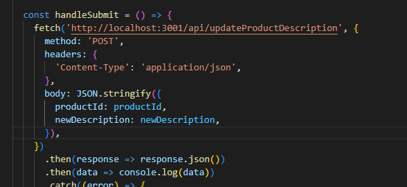
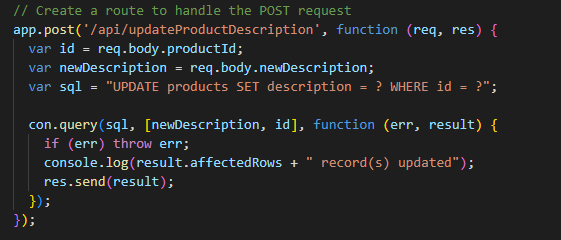
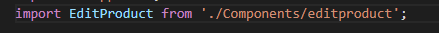

From root file run this to install dependencies:

cd Client && npm install
cd ../server && npm install

#Place .env file sent on teams in server directory before running, or you will get errors#

then run this to run the server & client
cd ../Client
npm run dev

How the app works:

Running 'npm run dev' in the client directory has been set up to run the server and client at the same time.

However you will need to navigate to each directory to install the dependencies needed to run the app.

User interface is in Client directory.

Server that communicates between the database and client is in server directory.

Client(from app.js) sends data to server via API request

Server then sends the applicable SQL request for the API request. from server.js

App.js imports and calls components from /components in order to have reusable components and keep everything organized

Saved procedures are saved in "procedures.txt" incase you would like to run it off of your own database.